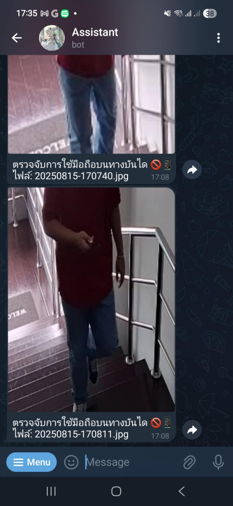

# 📱🚫 StepGuard — Stairway Phone Detection System

ระบบตรวจจับการใช้โทรศัพท์บนบันไดแบบเรียลไทม์  
พัฒนาโดยใช้ **YOLO + OpenCV** พร้อมฟีเจอร์แจ้งเตือนและบันทึกภาพผู้ฝ่าฝืนลงฐานข้อมูล

---

## ✨ ฟีเจอร์
- ตรวจจับคนที่ใช้มือถือขณะขึ้น-ลงบันไดแบบ Real-Time
- บันทึกภาพผู้ฝ่าฝืน (Snapshot) พร้อมเวลาลงในฐานข้อมูล
- รองรับการแจ้งเตือนผ่าน **Telegram Bot** หรือ Email
- สามารถกำหนดช่วงเวลาทำงาน (Active Hours) ได้
- Dashboard แสดงสถิติและภาพผู้ฝ่าฝืน

---

## 📂 โครงสร้างโปรเจกต์
```plaintext
StepGuard/
│
├─ main.py               # จุดเริ่มรันระบบ
├─ config.py             # การตั้งค่า เช่น โมเดล, เวลาทำงาน, การแจ้งเตือน
├─ detection.py          # โหลดโมเดล YOLO และรัน inference
├─ tracker.py            # ติดตามการถือโทรศัพท์และนับเวลา
├─ drawing.py            # วาดกรอบและข้อความลงบนภาพ
├─ camera.py             # จัดการการอ่านภาพจากกล้อง
├─ requirements.txt      # รายการ dependencies
├─ snapshots/            # เก็บภาพผู้ฝ่าฝืน
├─ model/
│   └─ phone_detect.pt   # โมเดล YOLO ที่เทรนแล้ว
└─ README.md             # คู่มือโครงการ
```

---

## ⚙️ การติดตั้ง

### 1️⃣ ติดตั้ง Python และ Git
- Python >= 3.9
- Git (สำหรับโคลนโค้ด)

### 2️⃣ โคลนโปรเจกต์
```bash
git clone https://github.com/yourname/StepGuard.git
cd StepGuard
```

### 3️⃣ ติดตั้ง Dependencies
```bash
pip install -r requirements.txt
```

---

## 🚀 การใช้งาน

### 1️⃣ รันระบบตรวจจับ
```bash
python main.py
```

### 2️⃣ การแจ้งเตือนผ่าน Telegram
- สร้าง Bot และรับ Token จาก **BotFather**
- ใส่ `TELEGRAM_BOT_TOKEN` และ `CHAT_ID` ใน `.env`

---

## 🖼️ ตัวอย่างการตรวจจับ


---

## 📜 License

**StepGuard Custom License v1.0**

- Permission is granted to use this source code **for educational and research purposes** only.
- Commercial use or revenue-generating projects are **strictly prohibited** without prior written consent from the author.
- Redistribution, modification, or integration into other software for sale is not allowed.
- Internal use within an organization is permitted, provided that proper credit is retained and the LICENSE file remains intact.
- The author assumes no liability for any damages arising from the use of this software.

