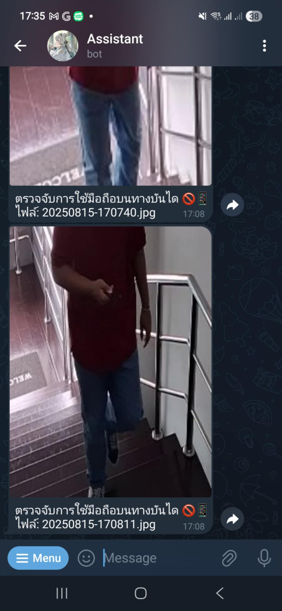

# 📱🚫 StepGuard — Stairway Phone Detection System
Real-time phone usage detection system on staircases  
Developed using **YOLO + OpenCV** with alert notifications and violator image logging to database
---
## ✨ Features
- Real-time detection of people using mobile phones while going up/down stairs
- Capture snapshots of violators with timestamp logging to database
- **Telegram Bot** notification support
- Configurable active hours functionality
---
## 📂 Project Structure
```plaintext
StepGuard/
├─ src/
│   ├─ main.py               # System entry point
│   ├─ config.py             # Configuration settings (model, active hours, notifications)
│   ├─ detection.py          # YOLO model loading and inference
│   ├─ Logic.py             # Phone holding tracking and timing logic
│   ├─ router.py            # Image sending and Telegram notification management
│   ├─ camera.py            # Camera input handling
│   └─ util.py              # Utility functions
├─ requirements.txt         # Dependencies list
├─ snapshots/              # Violator images storage
├─ model/
│   └─ phone_detect.pt     # Trained YOLO model
└─ README.md               # Project documentation
```
---
## ⚙️ Installation
### 1️⃣ Install Python and Git
- Python >= 3.9
- Git (for cloning the repository)
### 2️⃣ Clone the Project
```bash
git clone https://github.com/yourname/StepGuard.git
cd StepGuard
```
### 3️⃣ Install Dependencies
```bash
pip install -r requirements.txt

# or

uv sync
```
---
## 🚀 Usage
### 1️⃣ Run Detection System
```bash
python src/main.py

# or

uv run src/main.py
```
### 2️⃣ Telegram Notifications Setup
- Create a Bot and get Token from **BotFather**
- Add `TELEGRAM_BOT_TOKEN` and `CHAT_ID` to `.env` file
---
## 🖼️ Detection Example
<p align="center">
  
</p>
---
## 📜 License
**StepGuard Custom License v1.0**
- Permission is granted to use this source code **for educational and research purposes** only.
- Commercial use or revenue-generating projects are **strictly prohibited** without prior written consent from the author.
- Redistribution, modification, or integration into other software for sale is not allowed.
- Internal use within an organization is permitted, provided that proper credit is retained and the LICENSE file remains intact.
- The author assumes no liability for any damages arising from the use of this software.
