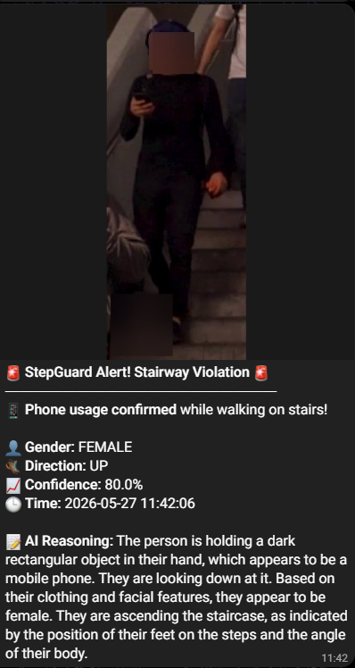
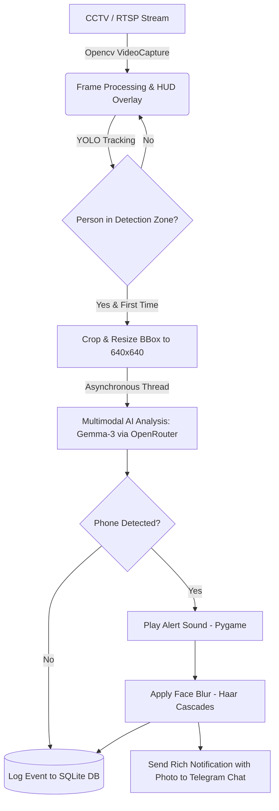

# 📱🚫 StepGuard — Stairway Phone Detection System

<p align="center">
  
</p>

An enterprise-grade, real-time staircase phone-usage monitoring and safety enforcement system. Developed using **YOLO Tracking**, **OpenCV**, and **Multimodal LLM Integration (OpenRouter / Gemma 3)**, StepGuard detects hazardous mobile phone usage on staircases, flashes a futuristic HUD overlay, triggers localized sound alerts, logs violations to a database, and forwards instant photo alerts to Telegram—all while protecting occupant privacy.

---

## ⚡ Quick Start (TL;DR)

Get StepGuard up and running in 3 simple steps using **`uv`**:

```bash
# 1️⃣ Clone & Navigate
git clone https://github.com/Kyaputan/StepGuard.git
cd StepGuard

# 2️⃣ Synchronize Dependencies
uv sync

# 3️⃣ Launch System Monitor
uv run src/main.py
```

---

## 🌟 Key Capabilities

*   **⚡ Real-Time YOLO Tracking:** Leverages custom-tuned YOLO models with persistence tracking to monitor multiple people ascending or descending staircases.
*   **🧠 Multimodal AI Verification:** Cropped candidate images are analyzed in the background by **Gemma 3 12B IT via OpenRouter**. This reduces false positives (e.g., holding keys or handrails) and extracts rich metadata (gender, direction, confidence, and reasoning).
*   **🎯 Smart Detection Zones:** Configurable horizontal detection bounds (Middle Zone Check) to focus inference strictly on active hazard areas, optimizing processing efficiency.
*   **🛡️ Active Privacy Shield:** Automated privacy enforcement using dual-stage OpenCV Haar Cascades (frontal and profile) to apply a strong Gaussian blur on faces *after* AI verification, securing personal identity before storage.
*   **🔊 Instant Threat Alarms:** Asynchronous audio alerts utilizing the `pygame` mixer interface to play localized audible warnings without interrupting the tracking stream.
*   **💬 Async Telegram Bot Alerts:** Instant rich-formatted HTML notifications sent directly to security channels containing the violator's blurred image, gender, direction, confidence score, and AI reasoning.
*   **📊 Persistent Analytics Database:** A lightweight local SQLite database logging violation statistics, gender/direction distribution, daily counts, and exact timeline logs.
*   **🔍 Interactive RTSP Discovery Tool:** An advanced, multi-threaded CCTV RTSP scanner featuring a beautiful **Rich TUI** to find, validate, and preview network camera feeds.

---

## ⚙️ System Architecture


```mermaid
flowchart TD
    A[CCTV / RTSP Stream] -->|Opencv VideoCapture| B(Frame Processing & HUD Overlay)
    B -->|YOLO Tracking| C{Person in Detection Zone?}
    C -->|No| B
    C -->|Yes & First Time| D[Crop & Resize BBox to 640x640]
    D -->|Asynchronous Thread| E[Multimodal AI Analysis: Gemma-3 via OpenRouter]
    E --> F{Phone Detected?}
    F -->|No| G[(Log Event to SQLite DB)]
    F -->|Yes| H[Play Alert Sound - Pygame]
    H --> I[Apply Face Blur - Haar Cascades]
    I --> G
    I --> J[Send Rich Notification with Photo to Telegram Chat]
```

---

## 📂 Project Structure

```plaintext
StepGuard/
├── src/
│   ├── main.py              # Main application entry point (futuristic HUD GUI loop)
│   ├── config.py            # Unified configuration loader & environments parser
│   ├── agent/
│   │   └── llm_analyzer.py  # LangChain ChatOpenAI client & Pydantic structured output
│   ├── db/
│   │   └── database.py      # SQLite schema creation, logging, & analytics queries
│   ├── services/
│   │   ├── sound_player.py  # Asynchronous pygame sound notification system
│   │   └── telegram_bot.py  # Asynchronous rich Telegram bot notification service
│   ├── tools/
│   │   └── detector.py      # YOLO tracker, ROI intersection logic & threat triggering
│   └── utils/
│       ├── blurface.py      # Privacy face-blurring utility (Haar Cascades + fallback)
│       ├── export_model.py  # ONNX / FP16 model export utility
│       ├── resizeimg.py     # Aspect-ratio preserving padding resize (640x640)
│       └── video_save.py    # RTSP video stream recorder tool
├── Findcctv.py              # Premium, Rich TUI RTSP camera finder & network scanner
├── cctv_config.json.example # Template for RTSP scanner configuration
├── pyproject.toml           # Project metadata and UV package management configuration
├── sound/
│   └── stop.wav             # Standard audible warning file
└── README.md                # This documentation
```

---

## 🚀 Installation & Environment Setup

### 1️⃣ Prerequisites
- **Python:** Version `>= 3.13` (Recommended)
- **C++ Build Tools:** Required for some dependencies like `lap` tracking.

### 2️⃣ Clone the Repository
```bash
git clone https://github.com/Kyaputan/StepGuard.git
cd StepGuard
```

### 3️⃣ Dependency Management (using `uv`)
StepGuard uses `uv` for ultra-fast, reproducible dependency resolution.

```bash
# Install uv if you haven't already
pip install uv

# Synchronize the environment
uv sync
```
*Note: PyTorch with CUDA 12.8 support is automatically mapped for Windows/Linux hosts in `pyproject.toml`.*

---

## ⚙️ Configuration (.env)

Create a `.env` file in the `src/` directory. Refer to [src/.env.example](file:///D:/Workspace/Other/StepGuard/src/.env.example) for baseline parameters:

```env
# Telegram Bot Configuration (Optional but highly recommended)
TELEGRAM_TOKEN=your_bot_token_here
CHAT_ID=your_chat_id_here

# OpenRouter Multimodal AI Configuration (Required for Gemma-3 analysis)
OPENROUTER_API_KEY=your_openrouter_api_key_here

# Camera Stream Configuration (0 for webcam, or RTSP URL / Local video path)
CAMERA_SOURCE=0
```

### Expanded Configuration Settings
You can fine-tune additional parameters in the system environment or within `src/config.py`:
- `YOLO_MODEL_PATH` (Default: `yolo26s.pt`)
- `MIDDLE_ZONE_TOP` / `MIDDLE_ZONE_BOTTOM` (Default: `0.45` to `0.55` fraction of the frame height)
- `SOUND_ALERT_PATH` (Default: `sound/stop.wav`)

---

## 💻 Usage

### 🚀 Running the Monitor
Start the real-time AI staircase monitor using the following command:

```bash
uv run src/main.py
```
*Press **'q'** inside the OpenCV active window to cleanly release resources and terminate.*

### 🔍 RTSP Camera Discovery (TUI Scanner)
Before launching the monitor, you can discover active cameras on your network by running our interactive scanner:

```bash
uv run Findcctv.py
```
This launches a beautiful, multi-threaded Rich TUI terminal interface to scan IP networks, probe common RTSP ports, test suffixes, and preview live feeds.

---

## 📊 Database Schema & Reporting
StepGuard automatically records all threat events in a local SQLite file (`stepguard.db`). It contains:
- **`timestamp`:** ISO 8601 formatting.
- **`image_path`:** Absolute path to the face-blurred violation crop.
- **`gender` / `direction`:** Extracted classification from Gemma 3.
- **`explanation`:** Complete text explaining visual cues.
- **`confidence`:** Decision confidence percentage.
- **`is_phone_detected`:** Filter flag for violations.

---

## 📜 License

This project is licensed under the **MIT License** - see the [LICENSE](file:///D:/Workspace/Other/StepGuard/LICENSE) file for details.

*   **Free to Use & Modify:** Anyone is free to use, modify, distribute, and build upon this software without prior permission.
*   **Liability Disclaimer:** The software is provided "as is", without warranty of any kind. The authors assume no liability for any damages or consequences arising from the use of this software.

